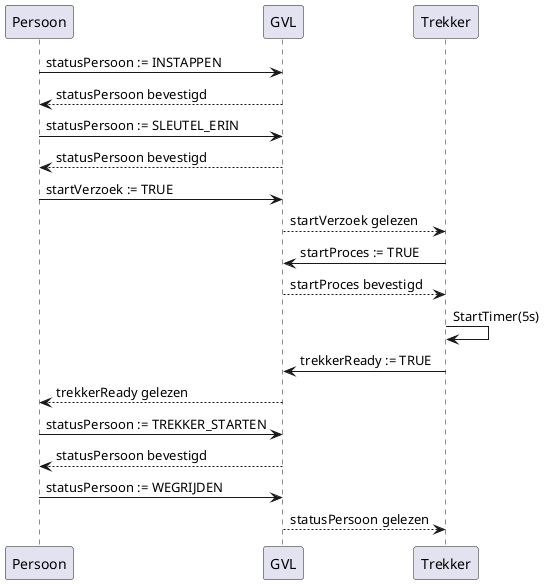

# Chapter 1

Lets add some text

```plantuml
@startuml
Persoon -> GVL: statusPersoon := INSTAPPEN
GVL --> Persoon: statusPersoon bevestigd

Persoon -> GVL: statusPersoon := SLEUTEL_ERIN
GVL --> Persoon: statusPersoon bevestigd

Persoon -> GVL: startVerzoek := TRUE
GVL --> Trekker: startVerzoek gelezen

Trekker -> GVL: startProces := TRUE
GVL --> Trekker: startProces bevestigd

Trekker -> Trekker: StartTimer(5s)

Trekker -> GVL: trekkerReady := TRUE
GVL --> Persoon: trekkerReady gelezen

Persoon -> GVL: statusPersoon := TREKKER_STARTEN
GVL --> Persoon: statusPersoon bevestigd

Persoon -> GVL: statusPersoon := WEGRIJDEN
GVL --> Trekker: statusPersoon gelezen
@enduml
```